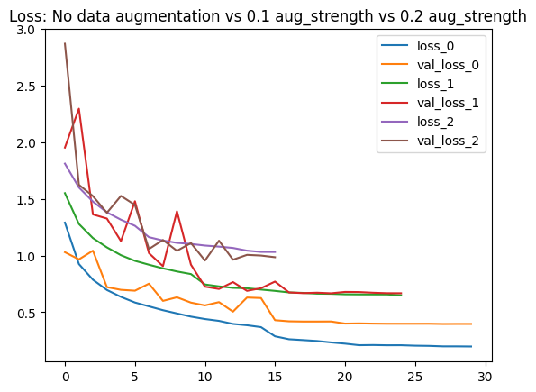
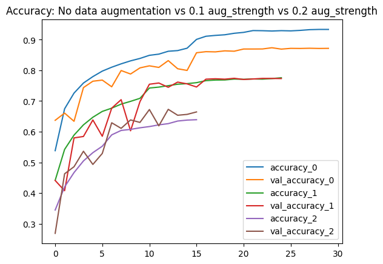
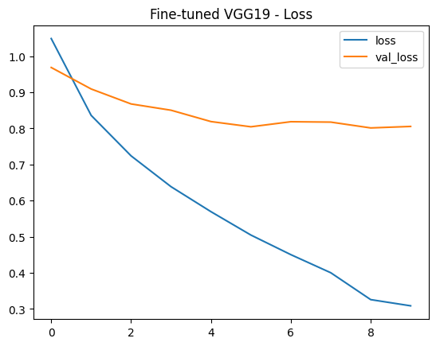
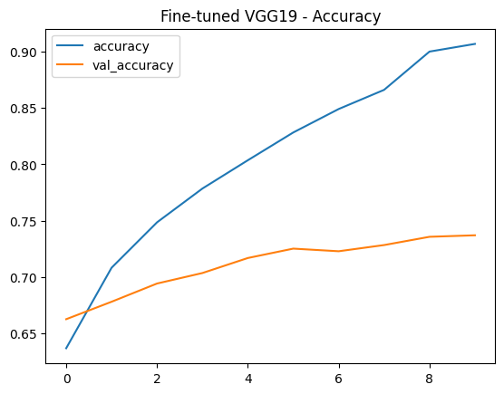
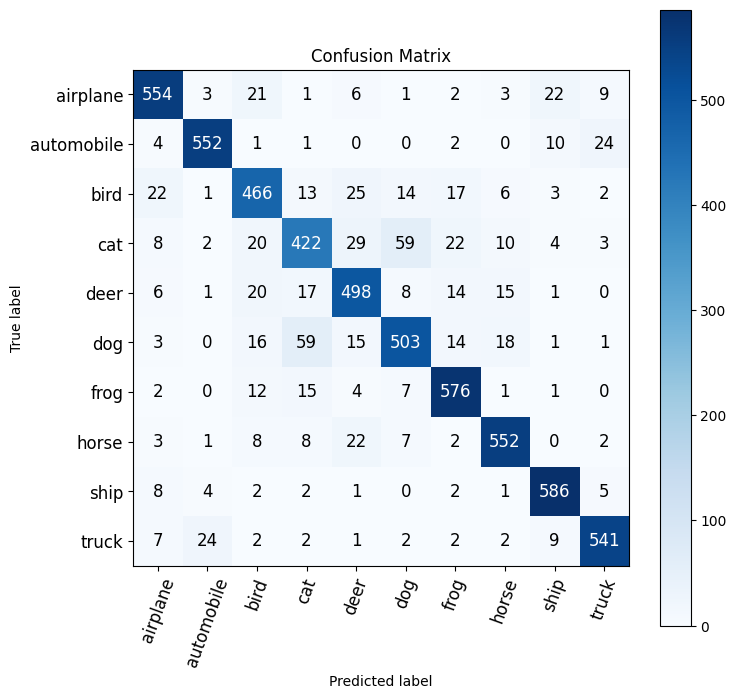
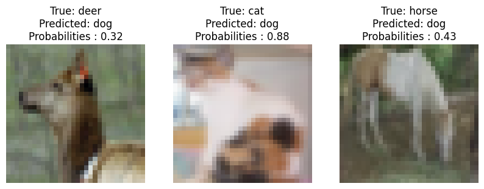

# Image Classification Pipeline (Deep Learning)

Automate image sorting and classification using deep learning.

## The Problem

Companies dealing with large image volumes (e-commerce, retail, logistics) struggle to:

- Manually classify products or items  
- Maintain consistent labeling  
- Scale operations efficiently  

This leads to time loss, errors, and operational bottlenecks.

## The Approach

This project demonstrates an end-to-end image classification pipeline using deep learning.

Two approaches are explored:

- A custom-built CNN optimized for performance  
- A transfer learning approach (VGG19)  

The goal is to build a reliable and scalable model for automated image classification.

## Results

- Custom CNN: ~87% accuracy  
- Transfer Learning (VGG19): ~75% accuracy  

Key takeaway:  
A well-optimized model tailored to the data can outperform standard pre-trained models.

## How This Can Be Used in a Company

This type of model can be used to:

- Automatically classify product images in a catalog  
- Detect and organize inventory items  
- Support quality control processes  
- Tag and structure large image datasets  

Example:  
An e-commerce company can automatically assign categories to new products instead of doing it manually.

## Business Impact

- Reduce manual workload  
- Improve classification consistency  
- Scale operations with growing data volumes  
- Enable automation of image-based workflows

## Technologies

- Python 
- TensorFlow/Keras
- CNN
- Transfer Learning (VGG19)
- Data Augmentation

## Model Performance

Training performance, model evaluation, and error analysis:

### Custom CNN — Training Curves

### VGG19 — Fine-Tuning Curves

### Confusion Matrix

### Misclassified Samples

## Work With Me

I help companies build and deploy AI models for image-based tasks.

I can help you:
- Automate image classification workflows  
- Build custom computer vision models  
- Improve existing models and performance  
- Prepare models for production (API, batch processing)  

Available for freelance projects.
